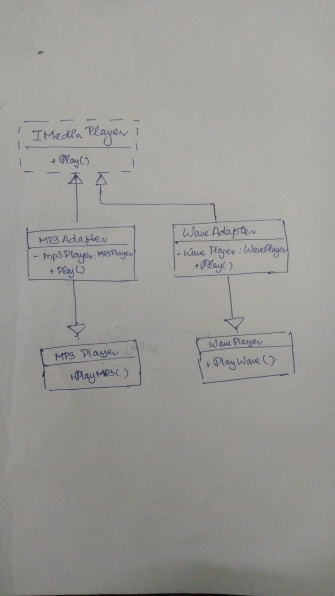

# **Media Player Adapter Pattern**

## **Overview**

This project demonstrates the Adapter Design Pattern applied to a media player application. The Adapter Pattern is used to make incompatible interfaces compatible. Specifically, this project allows a media player interface to play both MP3 and WAV files, even though the original classes for these formats have incompatible interfaces.

## **Project Structure**

* **Interfaces**
    * `IMediaPlayer`: Defines the contract for media player functionality.
* **Adaptee Classes**
    * `MP3Player`: A class that can only play MP3 files.
    * `WavePlayer`: A class that can only play WAV files.
* **Adapter Classes**
    * `MP3Adapter`: Adapts `MP3Player` to work with the `IMediaPlayer` interface.
    * `WaveAdapter`: Adapts `WavePlayer` to work with the `IMediaPlayer` interface.
* **Program**
    * Demonstrates how to use the adapters to play media files.

## **Design Pattern**

The Adapter Design Pattern allows incompatible interfaces to work together. In this project:

1. **Client Code**: Interacts with the media player through the `IMediaPlayer` interface.
2. **Adaptee Classes**: `MP3Player` and `WavePlayer` have their own methods for playing files but do not conform to the `IMediaPlayer` interface.
3. **Adapters**: `MP3Adapter` and `WaveAdapter` implement the `IMediaPlayer` interface and utilize instances of `MP3Player` and `WavePlayer` to provide the desired functionality.

## **Usage**

1. **Instantiate Adapters**: Create instances of `MP3Adapter` or `WaveAdapter`, passing an instance of `MP3Player` or `WavePlayer` to the constructors, respectively.
2. **Play Media**: Use the `Play` method of the adapter to play MP3 or WAV files, depending on the type specified.
3. **Handle Unsupported Formats**: If an unsupported format is passed, the adapter will return a message indicating that the format is invalid.annot be played.

## Module And Class Diagram

